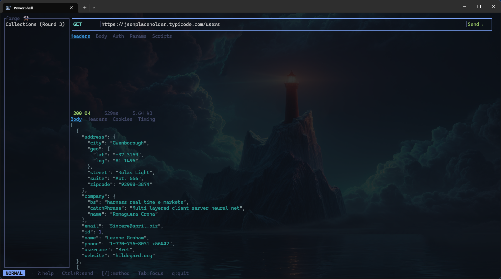

# forge ⚒️

> A blazingly fast, terminal-native API client - Postman in your terminal, built in Rust.

<!-- SCREENSHOT PLACEHOLDER -->
<!-- Replace the line below with your actual screenshot once available -->


---

## Why forge?

Postman is powerful. It's also 300MB of Electron, requires an account, and insists on phoning home. forge gives you the same power in a sub-5MB binary that starts in under 50ms, stores everything as plain TOML files, and never asks who you are.

| | Postman | Insomnia | Bruno | **forge** |
|---|---|---|---|---|
| Install size | ~300MB | ~250MB | ~120MB | **< 5MB** |
| Startup time | 3–8s | 2–5s | 1–3s | **< 50ms** |
| Requires account | Yes | Yes | No | **No** |
| File-based storage | No | No | Yes | **Yes** |
| Git-friendly | No | No | Yes | **Yes** |
| Terminal native | No | No | No | **Yes** |
| Vim keybindings | No | No | No | **Yes** |
| Open source | No | Partial | Yes | **Yes** |
| Offline first | Partial | Partial | Yes | **Yes** |

---

## Features

- **Modal editing** - Vim-inspired Normal / Insert / Command / Visual modes
- **HTTP methods** - GET, POST, PUT, PATCH, DELETE, HEAD, OPTIONS with color-coded badges
- **Syntax-highlighted responses** - JSON auto pretty-printed, XML, HTML, plain text via `syntect`
- **Async requests** - TUI never blocks; cancel in-flight requests with `Esc`
- **Environment variables** - `{{variable}}` interpolation with layered priority resolution
- **Collections & workspaces** - organize requests into folders, switch projects instantly
- **Auth support** - Basic, Bearer, API Key, OAuth 2.0
- **Request scripting** - Rhai pre/post hooks to automate workflows
- **Import / Export** - Postman, Insomnia, OpenAPI, cURL, HAR
- **File-based storage** - plain TOML files; diff them, commit them, share them

---

## Installation

No published releases yet. Clone and run from source:

```bash
git clone https://github.com/AlbertArakelyan/forge.git
cd forge
cargo run
```

For a release build:

```bash
cargo build --release
./target/release/forge
```

**Requirements:** Rust stable (1.80+). Install via [rustup.rs](https://rustup.rs).

---

## Quick Start

| Key | Action |
|-----|--------|
| `i` / `Enter` | Enter Insert mode on the URL bar |
| `[` / `]` | Cycle HTTP method |
| `Ctrl+R` | Send request |
| `Esc` | Return to Normal mode / cancel request |
| `Tab` / `Shift+Tab` | Cycle focus between panels |
| `j` / `k` | Scroll response body |
| `1`–`4` | Jump to URL bar / request editor / response viewer / sidebar |
| `q` | Quit |

---

## Storage

All data lives in plain files - no database, no cloud sync:

```
%APPDATA%\forge\                        (Windows)
~/.local/share/forge/                   (Linux)
~/Library/Application Support/forge/   (macOS)
```

Every request, collection, environment, and workspace is a human-readable TOML file you can edit, diff, and commit to Git.

---

## Roadmap

- [x] **Round 1** - Core Request Engine (URL bar, HTTP executor, response viewer, syntax highlighting)
- [ ] **Round 2** - Environment Variables (`{{variable}}` interpolation, env switcher, secret vars)
- [ ] **Round 3** - Collections & Workspaces (sidebar tree, tabs, file persistence)
- [ ] **Round 4** - Authentication (Basic, Bearer, API Key, OAuth 2.0, Digest)
- [ ] **Round 5** - Request Headers & Query Params (key-value editors, autocomplete, bidirectional URL sync)
- [ ] **Round 6** - Request Body Editor (JSON, Form, Multipart, GraphQL, Raw, Binary)
- [ ] **Round 7** - Response Viewer (collapsible JSON, search, timing waterfall)
- [ ] **Round 8** - History (persistent, searchable request log)
- [ ] **Round 9** - Scripting (Rhai pre/post hooks, script console)
- [ ] **Round 10** - Streaming & SSE (real-time event display, AI API streaming)
- [ ] **Round 11** - Import & Export (Postman, OpenAPI, cURL, Insomnia, Bruno, HAR)
- [ ] **Round 12** - Configuration & Theming (themes, layouts, custom keybindings, mouse support)
- [ ] **Round 13** - Polish, Performance & Release (< 50ms startup, virtual scrolling, distribution)

---

## Tech Stack

- **TUI** - `ratatui` + `crossterm`
- **HTTP** - `reqwest` (rustls, streaming, multipart)
- **Async** - `tokio`
- **Syntax highlighting** - `syntect`
- **Scripting** - `rhai`
- **Serialization** - `serde` + `toml` + `serde_json`

---

## License

MIT - Copyright (c) 2026 Albert Arakelyan
